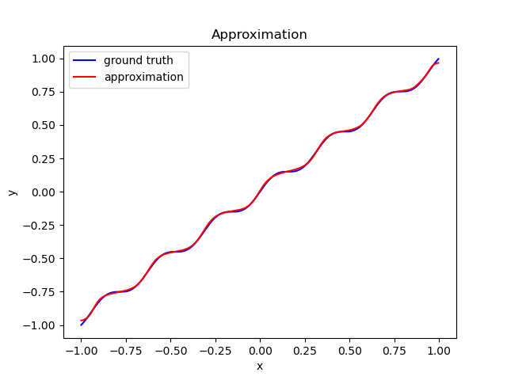
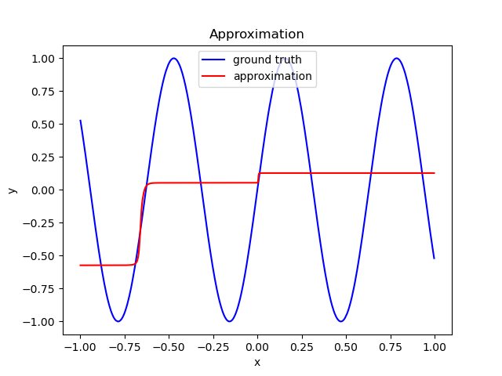

# MonotoneNeuralNetwork

## Structure

Compact neural network architecture approximating monotonical functions.
The restriction to monotonical functions is achieved by small changes in the general
formulation of a feed-forward architecture:

Considering a single layer network $f$ with input in $x \in \mathbb{R}^n$ with $\mathbb{m}^0 \in \{-1, 1\}^n$, indicating
that the network outputs are required to be non-increasing (-1) or non-decreasing (1) for the respective element
of $x$, the output of the layer is given defined as 

\begin{equation}
    f(x) = \sigma({\mathbb{m}^0}^TW^2x + b)
\end{equation}

, for any monotonically increasing activation function $\sigma$.

The partial derivative is then

\begin{equation}
    \frac{\delta f(x)_i}{x_j} = \dot{\sigma}(\mathbb{m}_0^TW^2x + b)_i \mathbb{m}^0_jW_{ij}^2
\end{equation}

, with $sign(\frac{\delta f(x)_i}{x_j}) = sign(\mathbb{m}_j)$.

Setting in a multi-layer network for all layers $i > 0$ $\mathbb{m}^i = \mathbb{1}$, 
the required monotonic property is preserved in the layer composition.

## Use cases

Regression with monotonic constraints (isotonic regression) can be a useful way of incorporating
a priori knowledge of a problem domain into the regression approach to avoid semantically degenerative fitting.
Using a neural network structure allows the end-to-end learning of monotonic mappings between
data ranges as subcomponent in larger neural network models.

